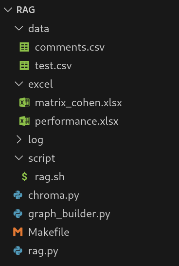

# Subjective Comment Classification with RAG + LLMs

Classifies students' free-text self-assessment comments into psycho-pedagogical categories using a Retrieval-Augmented Generation (RAG) pipeline built on locally-served open-weight LLMs.

## Context & Problem

This project is part of a learning-analytics platform where students take QCM (multiple-choice) tests and add a meta-cognitive layer on top of their answers:

1. They rate their **certainty** about each answer.
2. After seeing the correct answers, they write a free-text **self-assessment comment**.

These comments are rich but unstructured. Given an input

```json
{ "student": ..., "test": ..., "result": ..., "comment": "..." }
```

the goal is to automatically classify the comment into one (or two) of several predefined categories `C`, producing an enriched record `{ student, test, result, comment, C }` that downstream tools can use to give better feedback and track learning behaviours over time.

Several architectures were considered for this classification step (a single RAG-augmented LLM, an orchestrator coordinating specialized LLMs, or several LLMs "debating" to agree on a label). This repository implements and evaluates the **RAG-based single-LLM approach**.

## Architecture



The pipeline has two stages, both implemented in [`rag/`](rag):

1. **Knowledge base creation** — [`rag/chroma.py`](rag/chroma.py) reads the human-labeled comments from `rag/data/comments.csv`, embeds each one with a Hugging Face sentence-transformer, and stores them in a persistent **ChromaDB** collection (`rag/chroma_db/`).
2. **Retrieval + classification** — [`rag/graph_builder.py`](rag/graph_builder.py) wires a two-node **LangGraph** state graph:
   - `retrieve`: embeds the incoming comment and runs a similarity search against ChromaDB to fetch the `k` most similar labeled comments, used as few-shot context.
   - `generate`: fills a prompt template with the comment, the retrieved few-shot examples, and the category/keyword definitions, then sends it to an LLM served locally via **Ollama**. The LLM returns the predicted categor(y/ies), a confidence score per category, and a short justification.

[`rag/rag.py`](rag/rag.py) drives this graph over a held-out test set (`rag/data/test.csv`), logs every prediction, builds a confusion matrix, computes accuracy / Cohen's kappa / GPU energy draw, and exports everything to [`excel/`](excel).

| Folder/File | Role |
|-------------|------|
| `rag/data/comments.csv` | Human-labeled comments used to populate the vector store. |
| `rag/data/test.csv` | Held-out comments used to evaluate the system. |
| `rag/chroma.py` | Builds the ChromaDB collection from `comments.csv`. |
| `rag/graph_builder.py` | Defines the LangGraph retrieval + classification pipeline and the classification prompt. |
| `rag/rag.py` | Runs the pipeline on the test set and reports metrics. |
| `rag/script/rag.sh` | Entry point used to launch an evaluation run on the GPU server. |
| `excel/` | Evaluation outputs (confusion matrices, per-model performance, certainty/justification dumps). |

## Tech Stack

- **Language**: Python
- **Vector store**: [ChromaDB](https://www.trychroma.com/)
- **Embeddings**: Hugging Face `sentence-transformers/all-MiniLM-L6-v2`
- **LLM serving**: [Ollama](https://ollama.com/) (local inference, no external API calls)
- **Models evaluated**: Mistral, Phi-4, Llama 3.3
- **Orchestration**: [LangChain](https://www.langchain.com/) + [LangGraph](https://www.langchain.com/langgraph)
- **Evaluation/reporting**: pandas, openpyxl

## Results

The system classifies comments into **9 categories** (see the prompt in [`rag/graph_builder.py`](rag/graph_builder.py) for definitions and keywords), using 601 labeled comments as the retrieval corpus and 234 held-out comments for evaluation.

`rag/rag.py` currently reports **Accuracy** and **Cohen's Kappa** per model (plus GPU energy and runtime) in [`excel/performance.xlsx`](excel/performance.xlsx); per-class confusion matrices are in [`excel/matrix_cohen.xlsx`](excel/matrix_cohen.xlsx), from which an F1-score can be derived.

| Model | Accuracy | F1-score | Cohen's Kappa |
|-------|----------|----------|----------------|
| Mistral | [TO BE COMPLETED] | [TO BE COMPLETED] | [TO BE COMPLETED] |
| Phi-4 | [TO BE COMPLETED] | [TO BE COMPLETED] | [TO BE COMPLETED] |
| Llama 3.3 | [TO BE COMPLETED] | [TO BE COMPLETED] | [TO BE COMPLETED] |

## Quickstart

```bash
git clone https://github.com/kmadou019/subjective-comment-clf.git
cd subjective-comment-clf

python3 -m venv venv
source venv/bin/activate
pip install -r requirements.txt

# Make sure Ollama is running locally with the required models pulled
# (ollama pull mistral / phi4 / llama3.3)

cd rag
./chroma.py            # build the ChromaDB vector store from data/comments.csv
cd script
./rag.sh                # run the evaluation on data/test.csv
```

This project was developed and evaluated on a lab GPU cluster. For the full setup used in that environment (SSH/OAR job scheduling, a root-less Ollama install, Hugging Face token configuration, etc.), see [docs/DEV_SETUP.md](docs/DEV_SETUP.md).

## Demo

[TO BE COMPLETED]
